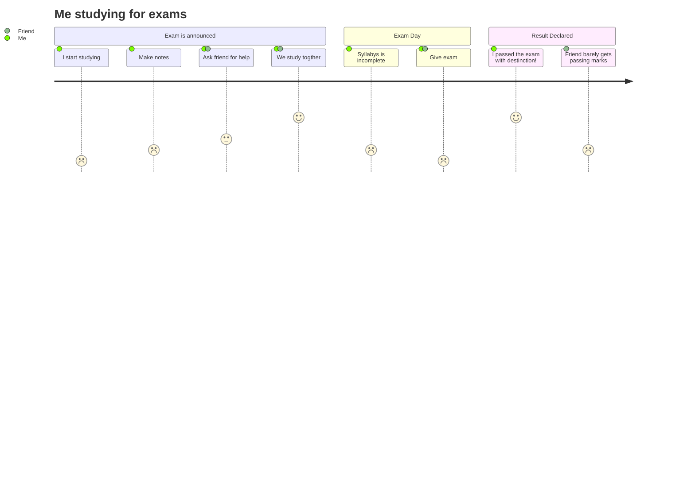

# Decimal to Binary Mantissa
Decimal to Binary Mantissa is a conversion tool for numerical approximation problems, designed for demonstrating computational methods. 

> The best way to crack a complex problem is to break it down into component parts, learn each of
the parts and learn how the parts go together. -Graham, R. L.

## Requirements
* g++ v5.4 or newer
* Make

## Compilation
The code can be compiled with the provided makefile using the standard `make` command.

If compiling the code manually, or integrating into a larger program, include the following flags: 
```
FLAGS=-std=c++11 -fsanitize=address,leak,undefined -Wall -Wextra -fuse-ld=gold
```
Note that flag `-fuse-ld=gold` is only required on certain Ubuntu systems due to a know bug with g++ 5.x.
## Sample Execution and Output
The program receives a real number in decimal (base 10) and converts it into binary (base 2). All input is handled through command line arguments. Sample input:
```
./convert_dec_to_binary.cpp 0.5 0.25 0.75
```
output *simliar* to
```
  | Base 10 | Base 2 |
  | :-------|:-------|
  | 0.5     | 0.1    |
  | 0.25    | 0.01   |
  | 0.75    | 0.11   |
```
will  be displayed. Note that the form will vary by architecture/system.


